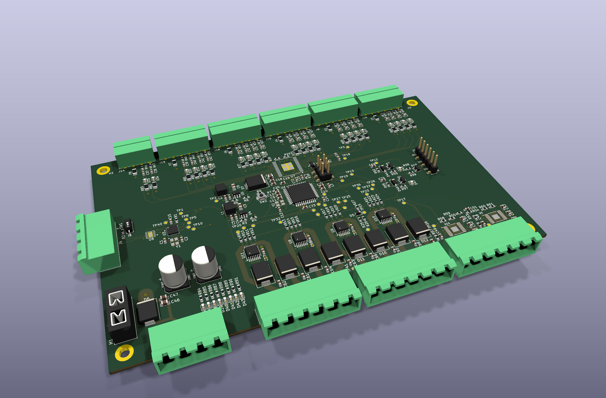

# Robust IO

A rugged industrial I/O board designed in KiCad 10.

## Status

- **Rev A:** released to fabrication on 2026-10-05 (JLCPCB, 5 bare boards,
  2 assembled). Not yet powered or tested.
- **Schematic:** complete across four hierarchical sheets. ERC clean.
- **PCB layout:** fully routed. DRC reports 0 errors and 4 library-mismatch
  warnings (J20, U1, U14, U7), which are intentional local footprint edits.

## Board

| Item | Value |
|---|---|
| Size | 160 x 100 mm, four M3 mounting holes |
| Layers | 4: F.Cu signal, In1 GND plane, In2 +24V plane, B.Cu signal |
| Copper | 2 oz outer, 1 oz inner |
| Minimum drill | 0.3 mm |
| Supply | 24 V nominal through a blade fuse (F1) and SMDJ24A TVS |
| Assembly | SMD parts on top side only; through-hole connectors and fuse holder hand-fitted |

## Architecture

| Sheet | Contents |
|---|---|
| `power` | Two TPS560430 buck regulators (+5V, +3.3V), input fuse, TVS, bulk capacitors |
| `processor` | ATmega1284P, MCP2515 + MCP2562 (CAN), crystals, ISP header (J1), UART header (J20), reset button |
| `inputs` | MC33978 22-channel switch detect with fused, filtered inputs and status LEDs |
| `outputs2` | Four BTS7008-2EPA dual high-side switches (8 outputs), two DRV8876 motor drivers |

## Connectors

- **J1:** 2x3 2.54 mm SMD header, AVR ISP (SPI is also on test points).
- **J20:** 1x6 2.54 mm SMD header, 3.3 V TTL UART in FTDI cable pinout.
  RX and TX have series resistors and a TVS array.
- **J14, J19, J18, J16, J9, J10 (top edge):** 3.5 mm pluggable terminal
  headers for the switch inputs, each with a fused supply pin and ground.
- **J15 (bottom edge):** 24 V supply input and ground.
- **J3, J5 (bottom edge):** high-side outputs OUT_0 to OUT_7, with +24V and
  ground.
- **J6 (bottom edge):** two motor driver outputs, with +24V and ground.
- **J4 (left edge):** CAN bus, +5V and ground. SW1 is next to it.

## Test points

41 test points (35 top, 6 bottom) cover the supply rails, SPI, UART, CAN
interrupt, driver control and sense lines, and ground. Positions and nets are
listed in `fab/robust-io-testpoints.csv`.

## Known limits of rev A

- The BTS7008-2EPA is rated for a 28 V maximum supply. Use a regulated 24 V
  supply; do not connect directly to a charging battery system.
- Reverse polarity protection is the fuse and TVS only. There is no series
  reverse-blocking stage.
- The input polyfuses are rated 30 V, which is a small margin over 24 V.
- Y1 load capacitors (22 pF) have not been matched to the crystal's
  specified load capacitance.
- Regulator output tracks are 0.2 mm wide.

## Files

- `robust-io.kicad_pro` - project file
- `robust-io.kicad_sch` - root sheet
- `power.kicad_sch`, `processor.kicad_sch`, `inputs.kicad_sch`, `outputs2.kicad_sch` - schematic sheets
- `robust-io.kicad_pcb` - PCB layout
- `robust-io.kicad_sym`, `sym-lib-table` - project symbol library
- `robust-io.kicad_dru` - custom design rules
- `DRC.rpt`, `ERC.rpt` - latest check reports

## Documentation (`docs/`)

| File | Content |
|---|---|
| [robust-io-schematic.pdf](docs/robust-io-schematic.pdf) | Schematic, all sheets |
| [layout-top.pdf](docs/layout-top.pdf), [layout-bottom.pdf](docs/layout-bottom.pdf) | Copper and silkscreen per side |
| [assembly-top.pdf](docs/assembly-top.pdf) | Assembly drawing with reference designators |
| [board-top.png](docs/board-top.png), [board-bottom.png](docs/board-bottom.png) | 3D renders |

Regenerate with `bash docs/make_docs.sh` after saving the schematic and board.

## Firmware (`firmware/`)

Design only at this stage. See [firmware/DESIGN.md](firmware/DESIGN.md) for the
pin map, architecture, console commands and CAN protocol proposal.

## Fabrication outputs (`fab/`)

| File | Purpose |
|---|---|
| `make_gerbers.sh` | Plots Gerbers, drill files and the position file with kicad-cli, then zips the Gerbers |
| `gerbers/`, `robust-io-gerbers.zip` | Gerber and Excellon drill files |
| `robust-io-BOM-JLC-smd.csv` | JLCPCB assembly BOM, 50 lines, LCSC part number on every line |
| `robust-io-CPL-JLC.csv` | JLCPCB placement file |
| `cpl_rotation_offsets.json` | Per-part rotation corrections applied to the placement file |
| `kicad-pos.csv` | Raw KiCad position export |
| `robust-io-BOM-tht.csv` | Through-hole parts to fit by hand (fuse holder, terminal headers) |
| `robust-io-testpoints.csv` | Test point list with nets and positions |
| `robust-io-fab-all.zip` | Everything above in one archive |

To regenerate the Gerbers after a board change, save the board in KiCad and run:

    bash fab/make_gerbers.sh

The placement file is not produced by the script. JLCPCB's rotation
convention differs from KiCad's for some packages, so the rotation for each
part in `robust-io-CPL-JLC.csv` is the KiCad rotation plus the offset in
`cpl_rotation_offsets.json`. Regenerate it whenever parts move, and check
the result in JLCPCB's placement preview before ordering.

## Bring-up order

1. Fit F1 and J15. Apply 24 V from a current-limited supply
   with nothing else connected.
2. Check +5V (TP2) and +3.3V (TP1) against ground.
3. Program the ATmega1284P over J1 and confirm the clock and UART on J20.
4. Bring up SPI to the MC33978 and MCP2515.
5. Enable the high-side outputs and motor drivers one channel at a time.

## License

See [LICENSE](LICENSE). Free for personal, educational, and open-source use.
For commercial licensing, contact ryan.lush@gmail.com.
